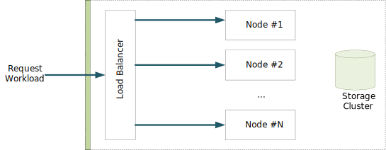
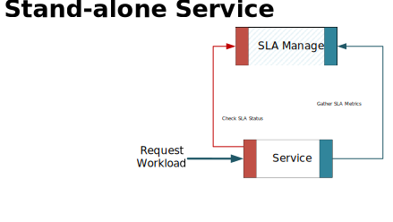
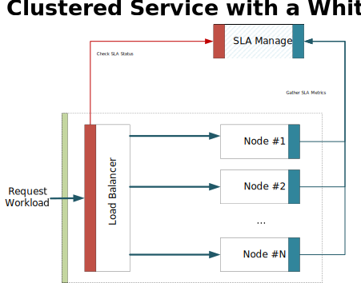
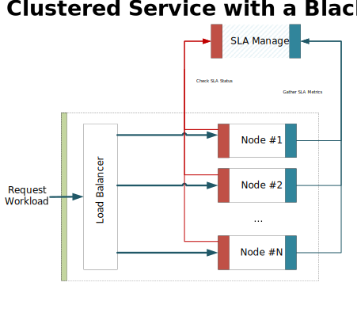

# SLA for Open API Initiative Specification

The key words "MUST", "MUST NOT", "REQUIRED", "SHALL", "SHALL NOT", "SHOULD", "SHOULD NOT", "RECOMMENDED", "MAY", and "OPTIONAL" 
in this document are to be interpreted as described in [RFC 2119](http://www.ietf.org/rfc/rfc2119.txt).

The **SLA4OAI** specification is licensed under [The Apache License, Version 2.0](http://www.apache.org/licenses/LICENSE-2.0.html).

## Revision History

|Version  | Date         | Notes          |
|:--------|:-------------|:---------------|
| 0.1     | 2015-12-18   | Initial draft. |

## 1. Introduction
**SLA4OAI** is an open source standard for describing SLA in APIs.

Based on the standards proposed by the [OAI](https://openapis.org/specification), SLA4OAI builds on top of it to add 
an optional profile for defining SLA (Service Level Agreements) over the APIs.

This SLA definition in a neutral vendor flavour will allow to foster innovation in the area where APIs expose and documents its SLA, 
API Management tools can import and measure such key metrics and composed SLAs for composed services aggregated way in a standard way.

### 1.1 Contents

A. This specification describes the format for defining SLAs ove APIs in a neutral technology way.

B. The **sla0** [spec](./operationalServices.md) provides a runtime standard API for measure and SLA enforcement defined in (A). 

C. Reference implementations are provided to show (A) and (B) in a real examples:

   1. Server side implementations: [sla-service-mock](https://sla-service-mock.herokuapp.com/), governify/v6   
   2. Client side implementations: plugins for generated [Hivepod](https://www.hivepod.io) backends. 

## 2. Execution Model
The execution model for SLA assumes as little as possible about the system to track the SLA to make it applicable in many scenarios. 



*Figure 1. Basic deployment for an API.*

Figure 1 shows a basic production deployment for a service exposing an API enhancement with a load-balancer and service redundancy 
for fault tolerance.

In order to instrument for SLA enforcement, some new services can be added to the picture, these services can be grouped into one unit called *SLA Manager* or it can be one or more independent services with different elasticity and scalability.

The roles considered are:

1. Service to instrument (single node or replicated)
2. Load balancer (optional)
3. SLA Manager (for SLA tracking)

Following the principle of Separation of Concerns, the `SLA Manager` exposes a simple API for tracking SLA and reporting metrics.
The service to be instrumented could be deployed as a single instance, cluster, with or without a front load balancer, etc.

Figures 2, 3 and 4 shows different possible configurations deployments. 



*Figure 2. Stand-alone deployment.*

Stand-alone deployments are typical in development scenarios where debugging is prioritized over high availiability.
In this scenario load-balancers are not involved and service is provided from a single node.



*Figure 3. Cluster with whitebox load-balancer deployment.*

A cluster with a whitebox load-balancer contain more than one nodes for the API and a load-balancer we can parametrize 
to verify the current state of the SLA on requests. Based on the state, the balancer can deny or allow the service.
The balancer is only responsible for checking SLA status, all metrices information gathered in the service node. 



*Figure 4. Cluster with blackbox load-balancer deployment.*

On the other hand, A cluster with a blackbox load-balancer cannot be parametrized for SLA checking. Therefore, SLA check and SLA 
enforce policies must be executed as middleware in the entrypoint for each service node.

Depending on the environment used: local development environment, private or pubic cloud, IaaS or PaaS you will find these different 
scenarios where an API is served.

## 3. Samples

### 3.1 Petstore
This sample illustrates a simple Resource based API for Pets database. 

- The full OpenAPI description is provided in [petstore-service.yml](./samples/petstore/petstore-service.yml).
- The service provides a SLA described in [petstore-sla.yml](./samples/petstore/petstore-sla.yml).


## 4. Specification
A **SLA4API** document is build as an extension to a given OpenAPI document. This extension will add a SLA definition to all or 
part of the services exposed in the API.
A full SLA definition is a JSON or a YAML document composed of the following structure.

### 4.1 Reference from an OpenAPI document
To declare a given API exposes an SLA, the OpenAPI description is extended with an optional attribute 
`x-sla` inside the `info` object. The value contains an URI pointing to the document describing the SLA. 

**Example:**

```
{
   "swagger": "2.0",
   "info":{
      "title": "Swagger Petstore (Simple)",
      "description": "A sample API that uses a petstore as an example to demonstrate features in the swagger-2.0 specification",
      "version": "1.0.0",
      "x-sla": "./petstore-sla.yml"
   }
}
```

```
swagger: '2.0'
info:
    title: "Swagger Petstore (Simple)"
    description: "A sample API that uses a petstore as an example to demonstrate features in the swagger-2.0 specification"
    version: "1.0.0"
    x-sla: ./petstore-sla.yml
```

### 4.2 SLA Document Schema
#### 4.2.1 SLA Object
The SLA Object must conform to the following constraints. 

| Field Name     | Type                                                  | Description  |
| :------------- | :---------------------------------------------------- | :------------|
| sla            | `string`                                              | **Required** Indicates the version of the sla format `='1.0'`. |
| api            | `uri`                                                 | **Required** Indicates an URI (absolute or relative) describing the API to instrument described in the OpenAPI format. |
| infrastructure | [`InfrastructureObject`](#4-2-2-infrastructureobject) | **Required** Provides information about tooling used for SLA storage, calculation, governance, etc. |
| provider       | `string`                                              | **Optional** Provider information: data about the owner/host of the API. |
| pricing        | [`PricingObject`](#4-2-3-pricingobject)               | **Optional** Global pricing data. |
| metrics        | [`MetricsObject`](#4-2-4-metricsobject)               | **Required** A list of metrics to use in the context of the SLA. |
| availability   | `string`                                              | **Optional** Availability of the service expressed via time slots using the [ISO 8601](https://www.w3.org/TR/NOTE-datetime) time intervals format. |
| plans          | [`PlansObject`](#4-2-5-plansobject)                   | **Required** A set of plans to define different SLA per plan. |
| quotas         | [`QuotasObject`](#4-2-6-quotasobject)                 | **Optional** Global quotas, these quotas affect all plans. |
| rates          | [`RatesObject`](#4-2-7-ratesobject)                   | **Optional** Global rates, these rates affect all plans. |
| guarantees     | [`GuaranteesObject`](#4-2-8-guaranteesobject)         | **Optional** Global guarantees, these guarantees affect all plans. |
| Consumer       | `string`                                              | **Optional** Consumer information, data about the entity that consumes the service. | 
| configuration  | `Map<string, string>`                                 | **Optional** Define the global configurations. |

#### 4.2.2 InfrastructureObject
The infrastructure object describes the operational tooling to use in the service execution. 

| Field Name     | Type          | Description  |
| :------------- | :------------:| :------------|
| supervisor     | `uri`         | **Optional** Location of the SLA manager used for SLA governance. |
| monitor        | `uri`         | **Required** Location of the SLA Check service accordingly to the [sla0](./operationalServices.md) spec. |
| registry       | `uri`         | **Required** Location of the SLA data storage service accordingly to the [sla0](./operationalServices.md) spec. |
| check          | `uri`         | **Required** Location of the SLA Check endpoint accordingly to the [sla0](./operationalServices.md) spec. |
| metrics        | `uri`         | **Required** Location of the SLA Metrics endpoint accordingly to the [sla0](./operationalServices.md) spec. |
| {name}         | `uri`         | **Optional** Optional endpoints of SLA governance infrastructure. |

**Example:**

```
{
   "infrastructure":{
      "supervisor": "http://supervisor.sla4oai.governify.io/v1/",
      "monitor": "http://monitor.sla4oai.governify.io/v1/",
      "registry": "http://registry.sla4oai.governify.io/v1/",
      "check": "http://check.sla4oai.governify.io/v1/",
      "metrics": "http://metrics.sla4oai.governify.io/v1/"
   }
}
```

```
infrastructure: 
  supervisor: "http://supervisor.sla4oai.governify.io/v1/"
  monitor: "http://monitor.sla4oai.governify.io/v1/"
  registry: "http://registry.sla4oai.governify.io/v1/"
  check: "http://check.sla4oai.governify.io/v1/"
  metrics: "http://metrics.sla4oai.governify.io/v1/"
```

#### 4.2.3 PricingObject
Describes the general information of the pricing of the API.

| Field Name     | Type          | Description  |
| :------------- | :------------:| :------------|
| cost           | `number`      | **Optional** Cost associated to this service. Defaults to `0` if unspecified. |
| currency       | `string`      | **Optional** Currency used to express the cost. Supported currency values are expressed in ISO 4217 format. Samples: `USD`, `EUR`, or `BTC` for US dollar, euro, or bitcoin, respectively. Defaults to `USD` if unspecified. |
| billing        | `string`      | **Optional** Period used for billing. Supported values are: - `onepay` Unique payment before start using the service. - `daily` Billing at end of the day. - `weekly` Billing at end of the week. - `monthly` Billing at end of the month. - `quartely` Billing at end  of the quarter. -  `yearly` Billing at end of the year. Default to `monthly` if unspecified. |

**Example:**

```
{
   "pricing":{
      "cost": 0,
      "currency": "euro",
      "billing": "monthly"
   }
}
```

```
pricing: 
  cost: 0
  currency: "euro"
  billing: "monthly"
```

#### 4.2.4 MetricsObject
Contains definitions of metrics with name, types and descriptions. References can be used to reuse definitions of pre-existing metrics.

| Field Name     | Type                                          | Description  |
| :------------- | :-------------------------------------------- | :------------|
| {name}         | [`MetricObject`](#4-2-5-metricobject)         | **Optional** Definitions of metrics with name, types and descriptions. |
| $ref           | `uri`                                         | **Optional** References to pre-existing metrics. |

**Example:**

```
{
  "metrics": {
    "animalTypes": {
      "type": "int64",
      "description": "Number of different animal types."
    },
    "$ref": "./metrics.yml"
  }
}
```

```
metrics:
  animalTypes:
    type: int64
    description: Number of different animal types.
  $ref: ./metrics.yml
```

#### 4.2.5 MetricObject
Contains definitions of metric with type, description and unit of the metric.

| Field Name     | Type                                          | Description  |
| :------------- | :-------------------------------------------- | :------------|
| type           | `string`                                      | **Required** This is the metric type accordingly to [the OAI spec format column](https://github.com/OAI/OpenAPI-Specification/blob/master/versions/2.0.md#data-types). |
| description    | `string`                                      | **Optional** A brief description of the metric. |
| unit           | `string`                                      | **Optional** The unit of the metric. |

**Example:**

```
{
  "animalTypes": {
    "type": "int64",
    "description": "Number of different animal types."
  }
}
```

```
animalTypes:
  type: int64
  description: Number of different animal types.
```


#### 4.2.5 PlansObject
Contains a list of plans describing different Level of Service and prices.

| Field Pattern  | Type                              | Description  |
| :------------- | :-------------------------------- | :------------|
| {planName}     | [`PlanObject`](#4-2-6-planobject) | Describes a usage plan for the API with its associate costs, availability and warranties. |

#### 4.2.6 PlanObject
Describes a plan in full.

| Field Name     | Type                                          | Description  |
| :------------- | :-------------------------------------------- | :------------|
| configuration  | `Object`                                      | **Optional** Configuration parameters for the service tailored for the plan. |
| availability   | `string`                                      | **Optional** Availability of the service for this plan expressed via time slots using the ISO 8601 time intervals format. |
| pricing        | [`PricingObject`](#4-2-3-pricingobject)       | **Optional** Specific pricing data for this plan. Overrides general pricing data defined before. |
| limits         | [`LimitsObject`](#4-2-7-limitsobject)         | **Optional** Defines the limits for the service on the current plan. |
| guarantees     | [`[GuaranteeObject]`](#4-2-8-guaranteeobject) | **Optional** Array of warranties in the current plan. |

#### 4.2.7 LimitsObject
*TBD*

#### 4.2.8 GuaranteeObject

*TBD*

Describes a warranty level supported by the plan.

| Field Name     | Type                              | Description  |
| :------------- | :-------------------------------- | :------------|
| objective      | [`Expression`](#5-expressions )   |  **Optional**            |
| period         | `string`                          |  **Optional** Period used for checking warrinty. Supported values are: `daily`, `weekly`, `monthly`,`yearly`. Default to `monthly` if unspecified. |
| window         | `string`                          |  **Optional**            |

**Example:**

```
{
   "guarantees":{
      "/pets":{
         "post":{
            "objective":"avgResponseTimeMs <= 800",
            "period":"daily",
            "window":"dynamic"
         }
      },
      "global":{
         "objective":"uptimePercentage > 95",
         "period":"monthly",
         "window":"static"
      }
   }
}
```

```
 guarantees: 
      /pets: 
        post: 
          - objective: "avgResponseTimeMs <= 800"
            period: "daily"
            window: "dynamic"
      global: 
        - objective: "uptimePercentage > 95"
          period: "monthly"
          window: "static"
```
## 5. Expressions 
*TBD* Supported expressions and BNF
### 5.1  Supported expressions
*TBD* Describe: Operators, data-types supported and predefined identifiers (and semantics)
### 5.2  Expression BNF
Grammar for expressions.

-----------------
*TODO*

## 6. References

1. Keywords for use in RFCs to Indicate Requirement Levels. [RFC 2119](http://www.ietf.org/rfc/rfc2119.txt).
2. [JSON](http://www.json.org)
3. [YAML](http://yaml.org/spec)
4. Datetime encoding. [ISO 8601](http://www.iso.org/iso/catalogue_detail?csnumber=40874)
5. [OpenAPI Specification](https://openapis.org/specification)
6. Currency codes. [ISO 4217](https://en.wikipedia.org/wiki/ISO_4217)